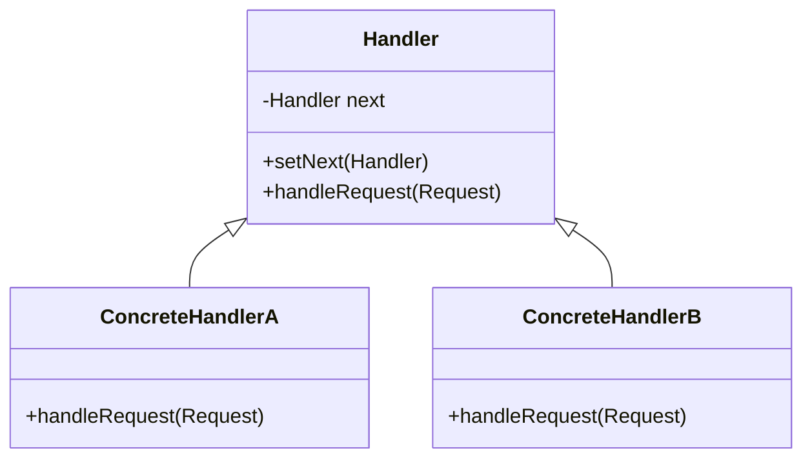

# Chain of Responsibility Pattern

## Intent
Avoid coupling the sender of a request to its receiver by giving more than one object a chance to handle the request. Chain the receiving objects and pass the request along the chain until an object handles it.

## Mermaid Diagram


## Interview Note
Think of middleware in web frameworks or support desk escalation (L1 -> L2 -> L3).

## Easy to Remember Example (Java)
```java
abstract class Logger {
    protected Logger next;
    public void setNext(Logger next) { this.next = next; }

    public abstract void logMessage(String message);
}

class ConsoleLogger extends Logger {
    public void logMessage(String message) {
        System.out.println("Console: " + message);
        if (next != null) next.logMessage(message);
    }
}
```
