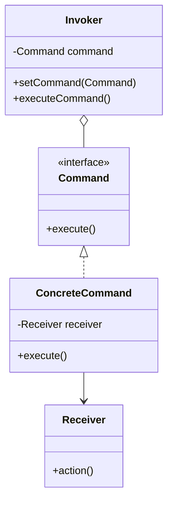

# Command Pattern

## Intent
Encapsulate a request as an object, thereby letting you parameterize clients with different requests, queue or log requests, and support undoable operations.

## Mermaid Diagram


## Interview Note
Perfect for implementing UI buttons, Undo/Redo mechanisms, and task queues.

## Easy to Remember Example (Java)
```java
interface Command { void execute(); }

// Receiver
class Light { public void turnOn() { System.out.println("Light is ON"); } }

// Concrete Command
class LightOnCommand implements Command {
    private Light light;
    public LightOnCommand(Light light) { this.light = light; }
    public void execute() { light.turnOn(); }
}

// Invoker
class RemoteControl {
    private Command command;
    public void setCommand(Command command) { this.command = command; }
    public void pressButton() { command.execute(); }
}
```
