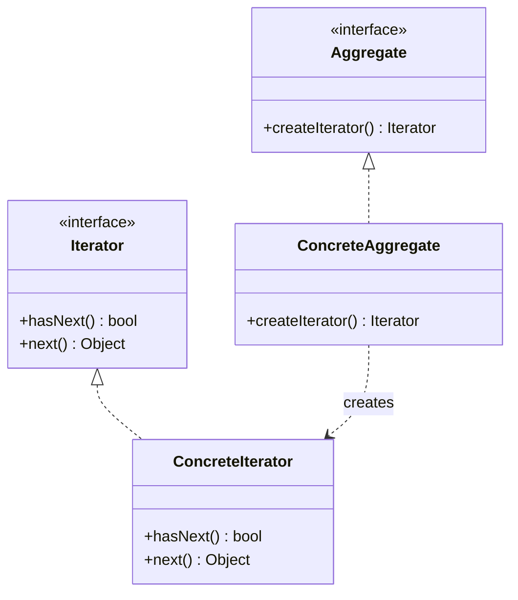

# Iterator Pattern

## Intent
Provide a way to access the elements of an aggregate object sequentially without exposing its underlying representation.

## Mermaid Diagram


## Interview Note
Separates the traversal algorithm from the data structure. Used extensively in Java Collections.

## Easy to Remember Example (Java)
```java
interface Iterator { boolean hasNext(); Object next(); }
interface Container { Iterator getIterator(); }

class NameRepository implements Container {
    public String[] names = {"Robert", "John", "Julie", "Lora"};

    public Iterator getIterator() { return new NameIterator(); }

    private class NameIterator implements Iterator {
        int index;
        public boolean hasNext() { return index < names.length; }
        public Object next() { return hasNext() ? names[index++] : null; }
    }
}
```
