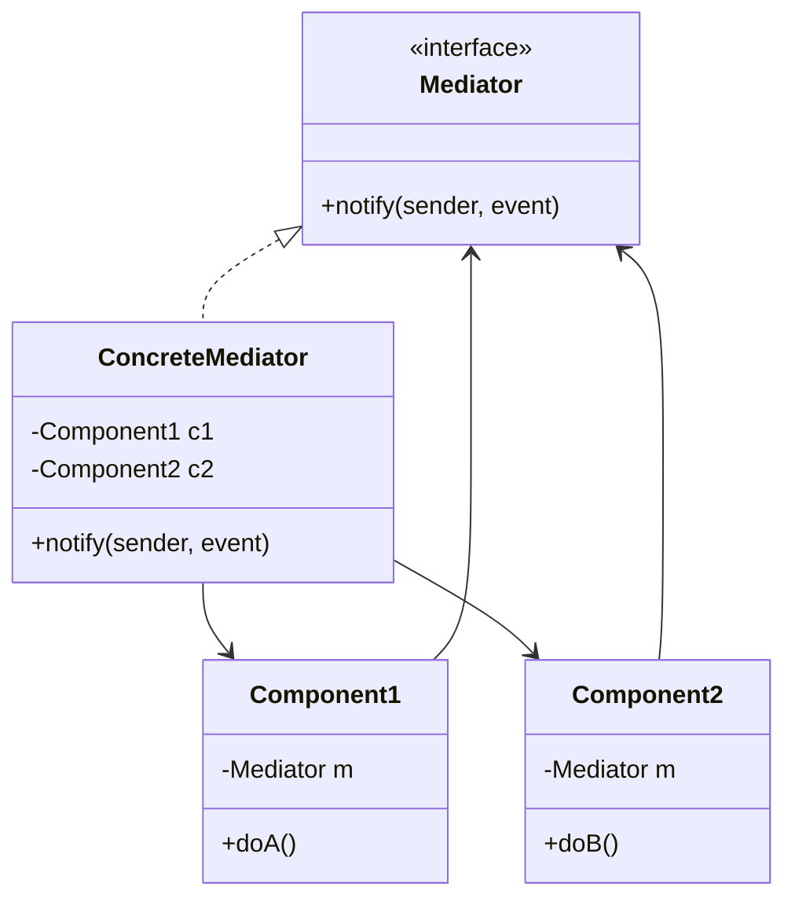

# Mediator Pattern

## Intent
Define an object that encapsulates how a set of objects interact. Mediator promotes loose coupling by keeping objects from referring to each other explicitly.

## Mermaid Diagram


## Interview Note
Like an Air Traffic Controller. Airplanes don't communicate with each other directly; they only communicate with the controller.

## Easy to Remember Example (Java)
```java
class ChatRoom {
    public static void showMessage(User user, String message) {
        System.out.println(user.getName() + ": " + message);
    }
}

class User {
    private String name;
    public User(String name) { this.name = name; }
    public String getName() { return name; }

    public void sendMessage(String message) {
        ChatRoom.showMessage(this, message);
    }
}
```
