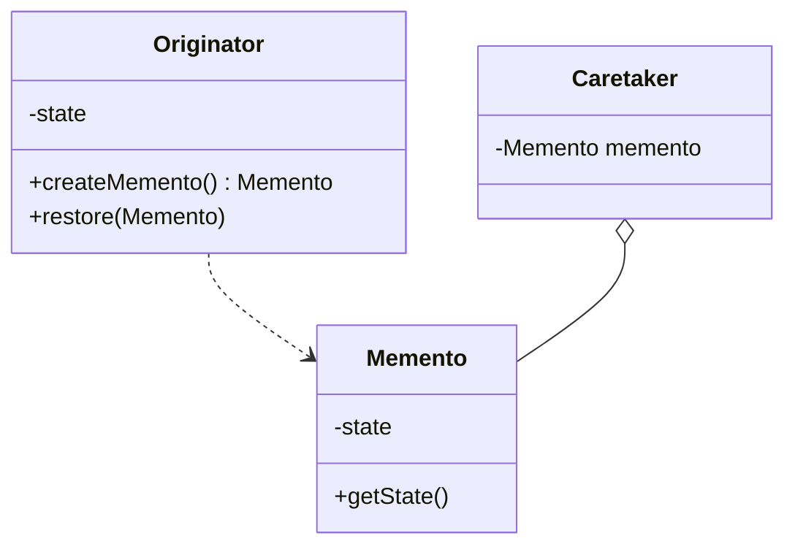

# Memento Pattern

## Intent
Without violating encapsulation, capture and externalize an object's internal state so that the object can be restored to this state later.

## Mermaid Diagram


## Interview Note
Allows for undo functionality without breaking encapsulation.

## Easy to Remember Example (Java)
```java
class Memento {
    private String state;
    public Memento(String state) { this.state = state; }
    public String getState() { return state; }
}

class Originator {
    private String state;
    public void setState(String state) { this.state = state; }
    public String getState() { return state; }
    public Memento saveStateToMemento() { return new Memento(state); }
    public void getStateFromMemento(Memento Memento) { state = Memento.getState(); }
}
```
