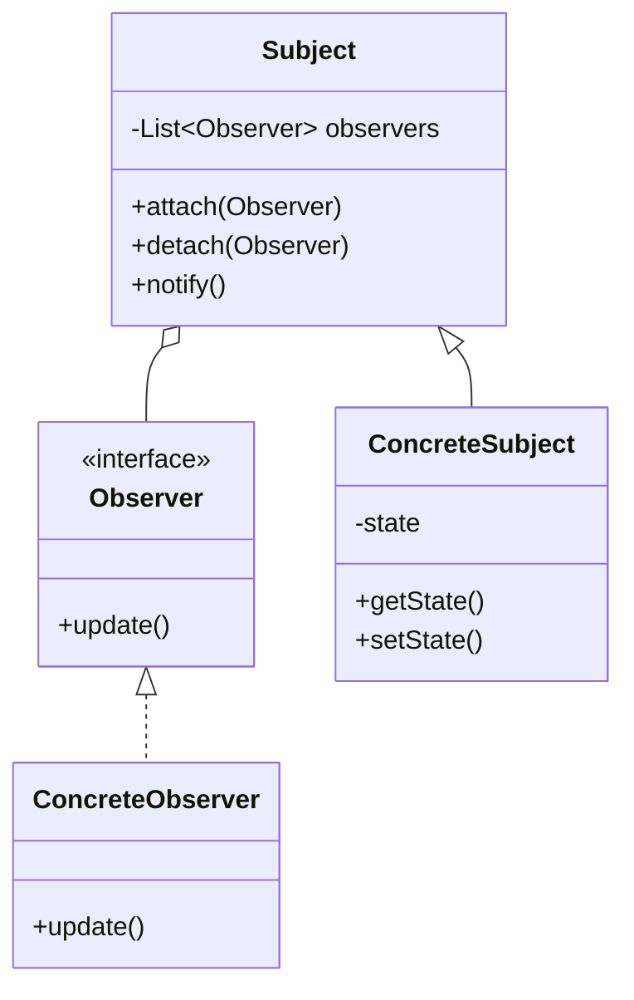

# Observer Pattern

## Intent
Define a one-to-many dependency between objects so that when one object changes state, all its dependents are notified and updated automatically.

## Mermaid Diagram


## Interview Note
Key pattern for Event-driven architectures, publish-subscribe mechanisms, and UI data binding.

## Easy to Remember Example (Java)
```java
interface Observer { void update(String message); }

class User implements Observer {
    private String name;
    public User(String name) { this.name = name; }
    public void update(String message) { System.out.println(name + " received: " + message); }
}

class Newsletter {
    private List<Observer> subscribers = new ArrayList<>();
    public void addObserver(Observer o) { subscribers.add(o); }

    public void publishInfo(String info) {
        for(Observer o : subscribers) { o.update(info); }
    }
}
```
