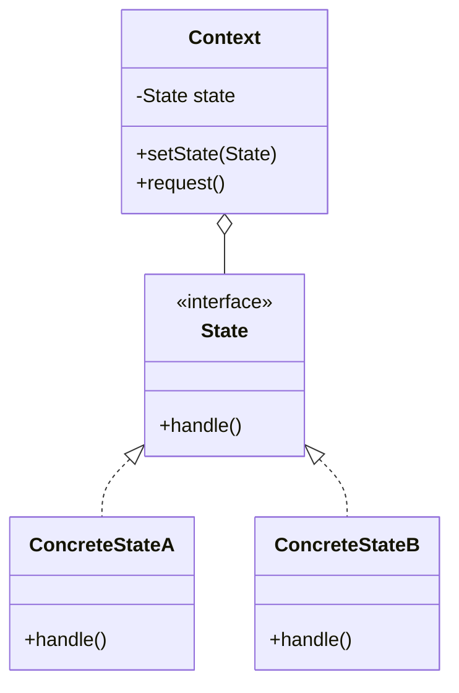

# State Pattern

## Intent
Allow an object to alter its behavior when its internal state changes. The object will appear to change its class.

## Mermaid Diagram


## Interview Note
Very similar to Strategy structurally, but in State, the states themselves usually know about each other and trigger transitions (e.g. Vending Machine states).

## Easy to Remember Example (Java)
```java
interface State { void doAction(Context context); }

class StartState implements State {
    public void doAction(Context context) {
        System.out.println("Player is in start state");
        context.setState(this);
    }
}

class Context {
    private State state;
    public void setState(State state) { this.state = state; }
    public State getState() { return state; }
}
```
