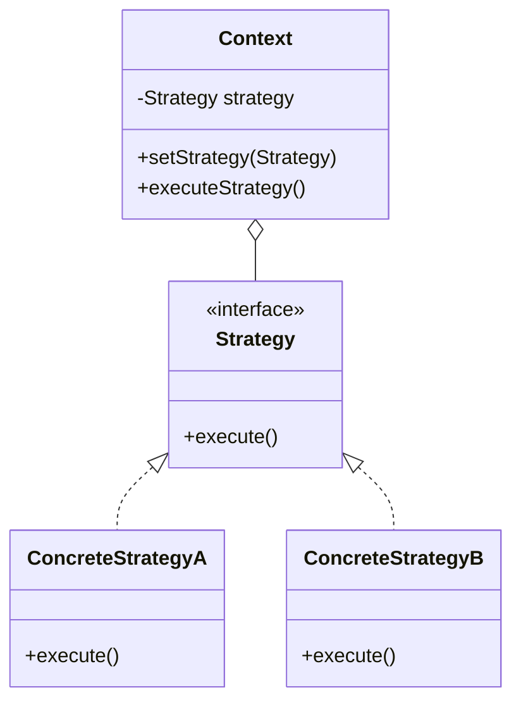

# Strategy Pattern

## Intent
Define a family of algorithms, encapsulate each one, and make them interchangeable. Strategy lets the algorithm vary independently from clients that use it.

## Mermaid Diagram


## Interview Note
Replaces multiple `if-else` or `switch` statements with polymorphism. E.g., choosing a payment method or sorting algorithm at runtime.

## Easy to Remember Example (Java)
```java
interface PaymentStrategy { void pay(int amount); }

class CreditCardPayment implements PaymentStrategy {
    public void pay(int amount) { System.out.println("Paid with Credit Card: " + amount); }
}

class PayPalPayment implements PaymentStrategy {
    public void pay(int amount) { System.out.println("Paid with PayPal: " + amount); }
}

class ShoppingCart {
    private PaymentStrategy strategy;
    public void setStrategy(PaymentStrategy strategy) { this.strategy = strategy; }
    public void checkout(int amount) { strategy.pay(amount); }
}
```
