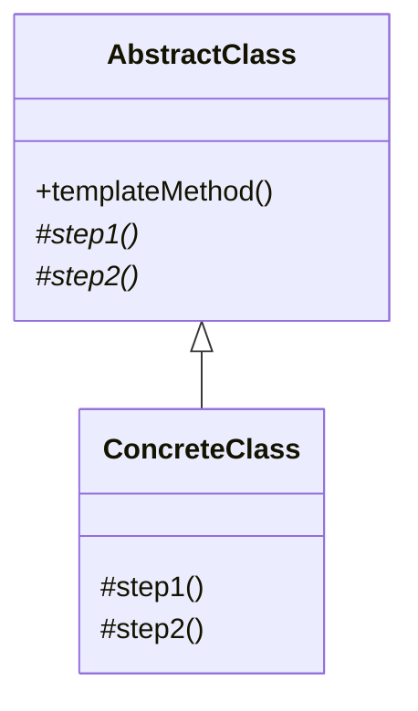

# Template Method Pattern

## Intent
Define the skeleton of an algorithm in an operation, deferring some steps to subclasses. Template Method lets subclasses redefine certain steps of an algorithm without changing the algorithm's structure.

## Mermaid Diagram


## Interview Note
The base class controls the overall workflow (the Template), while subclasses implement the specific details. E.g., a data miner that opens, parses, and closes a file (where parsing is deferred to subclasses).

## Easy to Remember Example (Java)
```java
abstract class Game {
    abstract void initialize();
    abstract void startPlay();
    abstract void endPlay();

    // Template method
    public final void play() {
        initialize();
        startPlay();
        endPlay();
    }
}

class Football extends Game {
    void initialize() { System.out.println("Football Initialized"); }
    void startPlay() { System.out.println("Football Started"); }
    void endPlay() { System.out.println("Football Finished"); }
}
```
