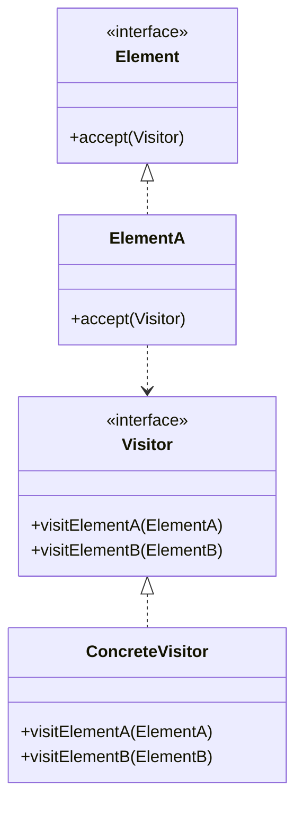

# Visitor Pattern

## Intent
Represent an operation to be performed on the elements of an object structure. Visitor lets you define a new operation without changing the classes of the elements on which it operates.

## Mermaid Diagram


## Interview Note
Good when operations change often, but the structure remains the same. Double dispatch.

## Easy to Remember Example (Java)
```java
interface ComputerPartVisitor { void visit(Keyboard keyboard); }

interface ComputerPart { void accept(ComputerPartVisitor visitor); }

class Keyboard implements ComputerPart {
    public void accept(ComputerPartVisitor visitor) { visitor.visit(this); }
}

class ComputerPartDisplayVisitor implements ComputerPartVisitor {
    public void visit(Keyboard keyboard) { System.out.println("Displaying Keyboard."); }
}
```
