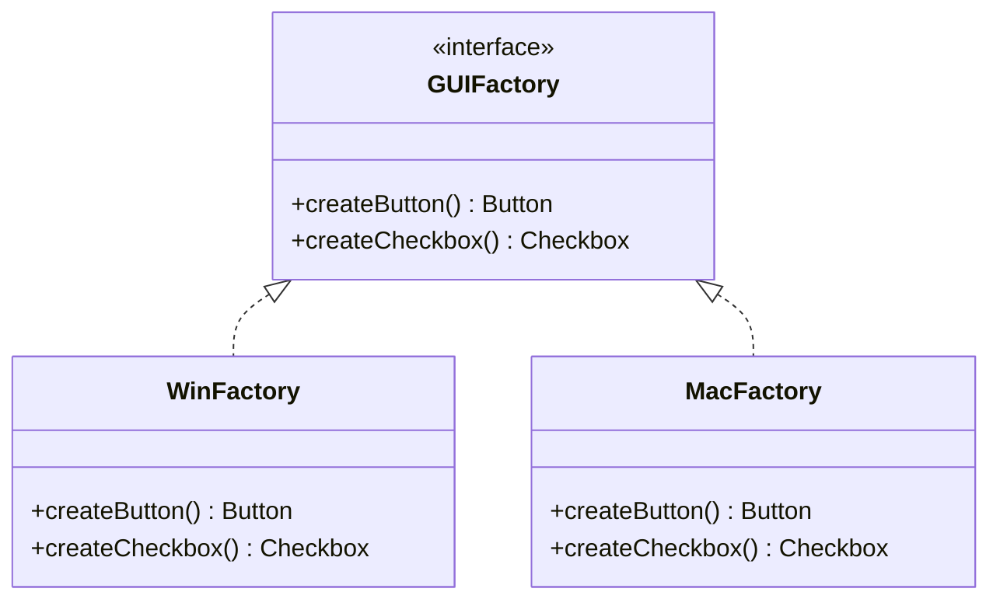

# Abstract Factory Pattern

## Intent
Provide an interface for creating families of related or dependent objects without specifying their concrete classes.

## Mermaid Diagram


## Interview Note
Used when the system needs to be independent of how its products are created, composed, and represented. It groups related factories.

## Easy to Remember Example (Java)
```java
interface Button { void render(); }
interface Checkbox { void render(); }

interface GUIFactory {
    Button createButton();
    Checkbox createCheckbox();
}

class MacFactory implements GUIFactory {
    public Button createButton() { return new MacButton(); }
    public Checkbox createCheckbox() { return new MacCheckbox(); }
}

class WinFactory implements GUIFactory {
    public Button createButton() { return new WinButton(); }
    public Checkbox createCheckbox() { return new WinCheckbox(); }
}
```
