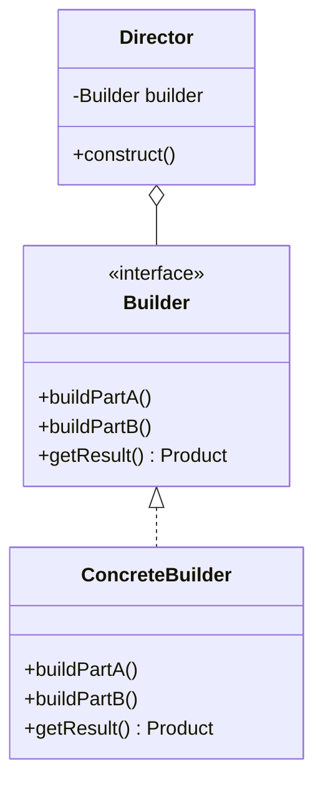

# Builder Pattern

## Intent
Separate the construction of a complex object from its representation so that the same construction process can create different representations.

## Mermaid Diagram


## Interview Note
Often implemented in Java as a static inner class `Builder`. Useful when an object has many optional parameters.

## Easy to Remember Example (Java)
```java
public class User {
    private String name;
    private int age;

    private User(UserBuilder builder) {
        this.name = builder.name;
        this.age = builder.age;
    }

    public static class UserBuilder {
        private String name;
        private int age;

        public UserBuilder setName(String name) { this.name = name; return this; }
        public UserBuilder setAge(int age) { this.age = age; return this; }
        public User build() { return new User(this); }
    }
}

// Usage: User u = new User.UserBuilder().setName("Alice").setAge(30).build();
```
