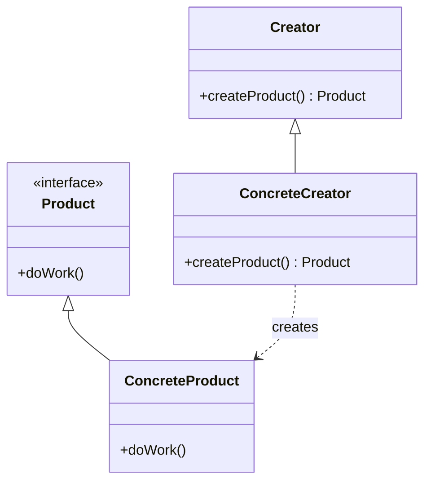

# Factory Method Pattern

## Intent
Define an interface for creating an object, but let subclasses decide which class to instantiate.

## Mermaid Diagram


## Interview Note
Instead of calling `new`, you call a method that returns an interface, letting the subclasses decide the exact implementation.

## Easy to Remember Example (Java)
```java
interface Animal { void speak(); }
class Dog implements Animal { public void speak() { System.out.println("Woof"); } }
class Cat implements Animal { public void speak() { System.out.println("Meow"); } }

abstract class AnimalFactory {
    public abstract Animal createAnimal();
}

class DogFactory extends AnimalFactory {
    public Animal createAnimal() { return new Dog(); }
}
```
