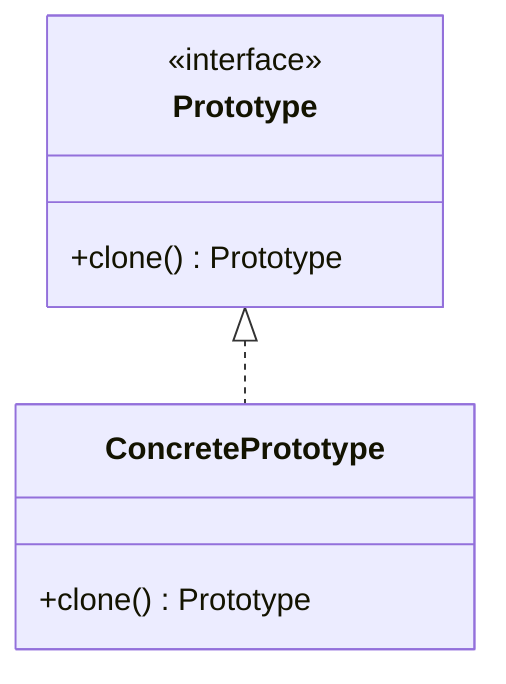

# Prototype Pattern

## Intent
Specify the kinds of objects to create using a prototypical instance, and create new objects by copying this prototype.

## Mermaid Diagram


## Interview Note
Reduces subclassing and avoids cost of creating objects from scratch (like reading from DB). Make sure to handle deep vs shallow copy!

## Easy to Remember Example (Java)
```java
abstract class Shape implements Cloneable {
    public String id;
    public abstract void draw();

    public Object clone() {
        Object clone = null;
        try { clone = super.clone(); }
        catch (CloneNotSupportedException e) { e.printStackTrace(); }
        return clone;
    }
}

class Rectangle extends Shape {
    public void draw() { System.out.println("Rectangle"); }
}
```
