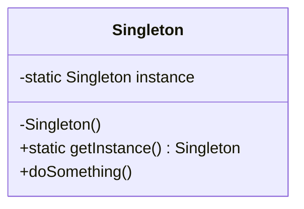

# Singleton Pattern

## Intent
Ensure a class has only one instance and provide a global point of access to it.

## Mermaid Diagram


## Interview Note
Use **Double-Checked Locking** to make it thread-safe and performant in multithreaded environments.

## Easy to Remember Example (Java)
```java
public class Singleton {
    private static volatile Singleton instance;

    private Singleton() {
        // private constructor
    }

    public static Singleton getInstance() {
        if (instance == null) {
            synchronized (Singleton.class) {
                if (instance == null) {
                    instance = new Singleton();
                }
            }
        }
        return instance;
    }
}
```
