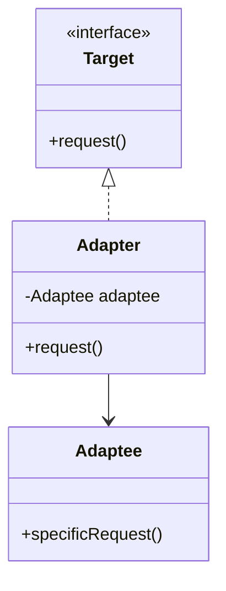

# Adapter Pattern

## Intent
Convert the interface of a class into another interface clients expect. Adapter lets classes work together that couldn't otherwise because of incompatible interfaces.

## Mermaid Diagram


## Interview Note
Think of a power adapter for traveling. Wraps an existing class (Adaptee) with a new interface (Target).

## Easy to Remember Example (Java)
```java
interface USAPlug { void provide110V(); }
class EuropeanSocket { public void provide220V() { System.out.println("220V"); } }

// Adapter
class SocketAdapter implements USAPlug {
    private EuropeanSocket socket;
    public SocketAdapter(EuropeanSocket socket) { this.socket = socket; }

    public void provide110V() {
        socket.provide220V();
        System.out.println("Converting 220V to 110V");
    }
}
```
