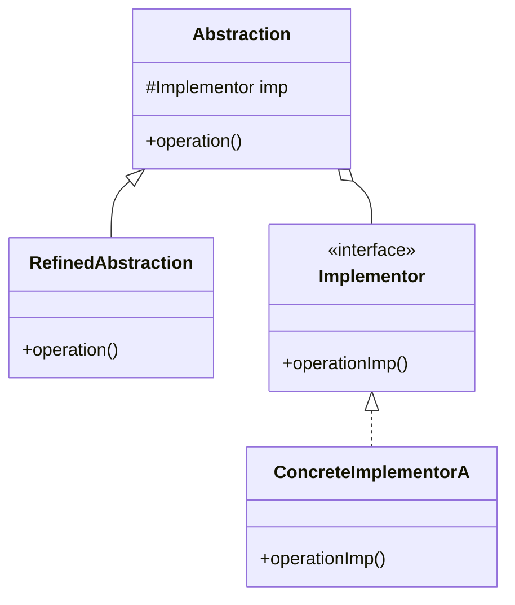

# Bridge Pattern

## Intent
Decouple an abstraction from its implementation so that the two can vary independently.

## Mermaid Diagram


## Interview Note
Prevents Cartesian product complexity (e.g., instead of `RedCircle`, `BlueCircle`, `RedSquare`, `BlueSquare`, you have `Shape` containing a `Color`).

## Easy to Remember Example (Java)
```java
interface Color { void applyColor(); }
class Red implements Color { public void applyColor() { System.out.println("Red"); } }

abstract class Shape {
    protected Color color;
    public Shape(Color c) { this.color = c; }
    abstract public void draw();
}

class Circle extends Shape {
    public Circle(Color c) { super(c); }
    public void draw() {
        System.out.print("Drawing Circle in ");
        color.applyColor();
    }
}
```
