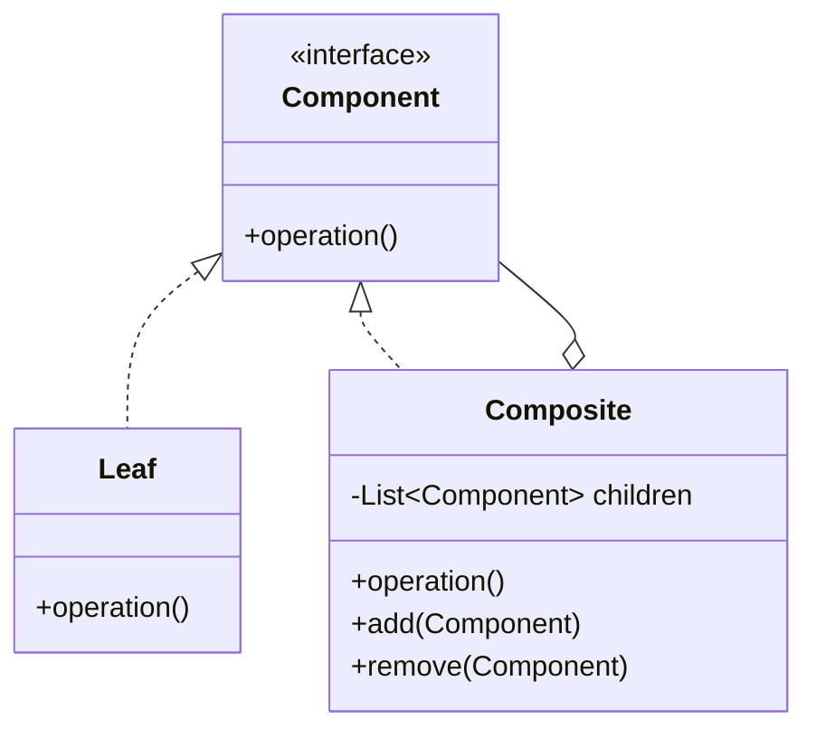

# Composite Pattern

## Intent
Compose objects into tree structures to represent part-whole hierarchies. Composite lets clients treat individual objects and compositions of objects uniformly.

## Mermaid Diagram


## Interview Note
Used widely in UI frameworks (a Window has Panels, which have Buttons. All are GUI Components).

## Easy to Remember Example (Java)
```java
interface Employee { void showDetails(); }

class Developer implements Employee {
    public void showDetails() { System.out.println("Developer"); }
}

class Manager implements Employee {
    private List<Employee> subordinates = new ArrayList<>();

    public void addEmployee(Employee emp) { subordinates.add(emp); }

    public void showDetails() {
        System.out.println("Manager");
        for(Employee emp : subordinates) { emp.showDetails(); }
    }
}
```
