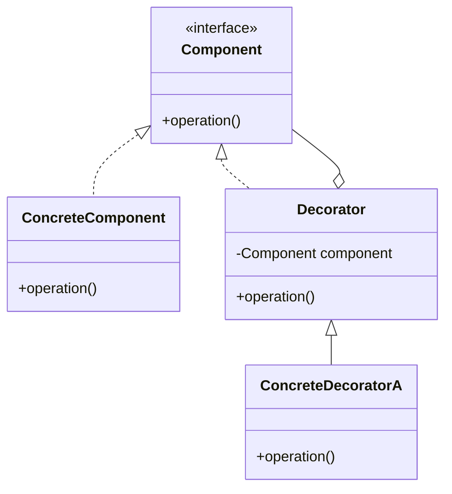

# Decorator Pattern

## Intent
Attach additional responsibilities to an object dynamically. Decorators provide a flexible alternative to subclassing for extending functionality.

## Mermaid Diagram


## Interview Note
Think of adding toppings to a pizza. `Coffee c = new Milk(new Sugar(new SimpleCoffee()));`

## Easy to Remember Example (Java)
```java
interface Coffee { double getCost(); }

class SimpleCoffee implements Coffee {
    public double getCost() { return 2.0; }
}

abstract class CoffeeDecorator implements Coffee {
    protected Coffee decoratedCoffee;
    public CoffeeDecorator(Coffee c) { this.decoratedCoffee = c; }
    public double getCost() { return decoratedCoffee.getCost(); }
}

class MilkDecorator extends CoffeeDecorator {
    public MilkDecorator(Coffee c) { super(c); }
    public double getCost() { return super.getCost() + 0.5; }
}
```
