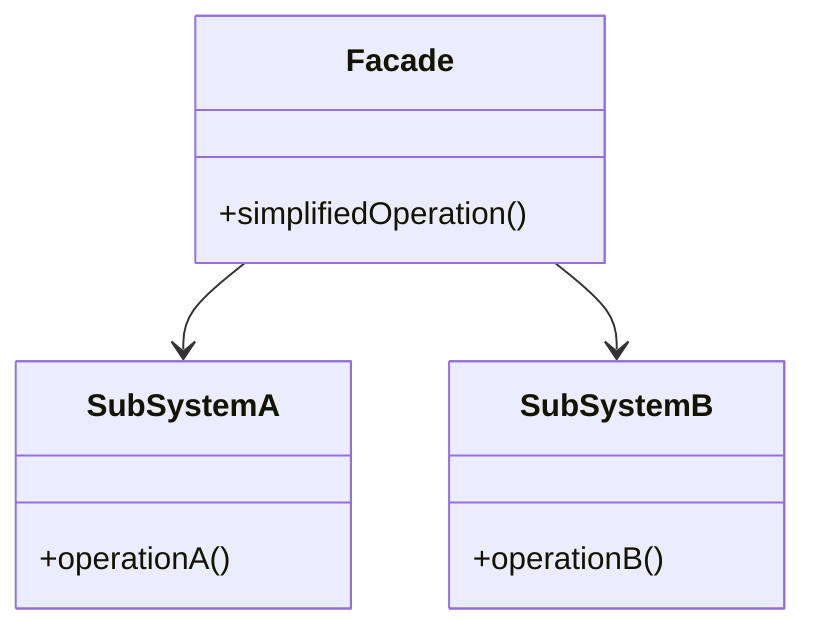

# Facade Pattern

## Intent
Provide a unified interface to a set of interfaces in a subsystem. Facade defines a higher-level interface that makes the subsystem easier to use.

## Mermaid Diagram


## Interview Note
Hides subsystem complexity. Instead of calling 5 different classes to start a car, you just call `carFacade.start()`.

## Easy to Remember Example (Java)
```java
class CPU { void freeze() {} void jump() {} void execute() {} }
class Memory { void load() {} }
class HardDrive { void read() {} }

// Facade
class ComputerFacade {
    private CPU cpu = new CPU();
    private Memory mem = new Memory();
    private HardDrive hd = new HardDrive();

    public void start() {
        cpu.freeze();
        mem.load();
        cpu.jump();
        cpu.execute();
    }
}
```
