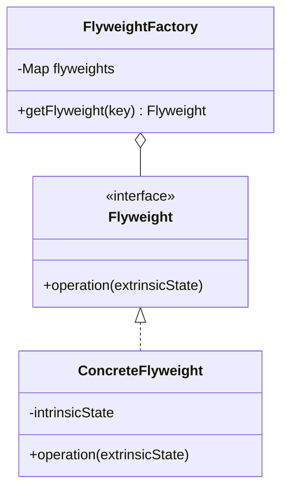

# Flyweight Pattern

## Intent
Use sharing to support large numbers of fine-grained objects efficiently.

## Mermaid Diagram


## Interview Note
Saves memory by sharing states across objects. Frequently used in graphics and game programming for things like trees or bullets.

## Easy to Remember Example (Java)
```java
interface Shape { void draw(); }

class Circle implements Shape {
    private String color;
    public Circle(String color) { this.color = color; }
    public void draw() { System.out.println("Circle: Draw() [Color : " + color + "]"); }
}

class ShapeFactory {
    private static final HashMap<String, Shape> circleMap = new HashMap();

    public static Shape getCircle(String color) {
        Circle circle = (Circle)circleMap.get(color);
        if(circle == null) {
            circle = new Circle(color);
            circleMap.put(color, circle);
        }
        return circle;
    }
}
```
