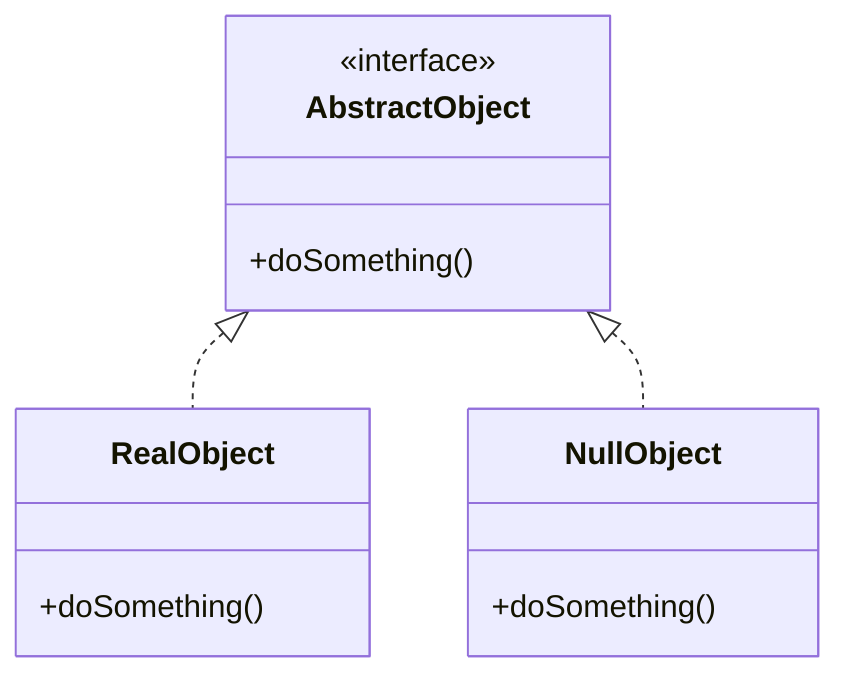

# Null Object Pattern

## Intent
Provide an object as a surrogate for the lack of an object of a given type. The Null Object Pattern provides intelligent do nothing behavior, hiding the details from its collaborators.

## Mermaid Diagram


## Interview Note
Replaces checking for null references. Instead of returning `null`, a class returns a `NullObject` that implements the interface but does nothing.

## Easy to Remember Example (Java)
```java
abstract class AbstractCustomer {
    protected String name;
    public abstract boolean isNil();
    public abstract String getName();
}

class RealCustomer extends AbstractCustomer {
    public RealCustomer(String name) { this.name = name; }
    public String getName() { return name; }
    public boolean isNil() { return false; }
}

class NullCustomer extends AbstractCustomer {
    public String getName() { return "Not Available in Customer Database"; }
    public boolean isNil() { return true; }
}
```
