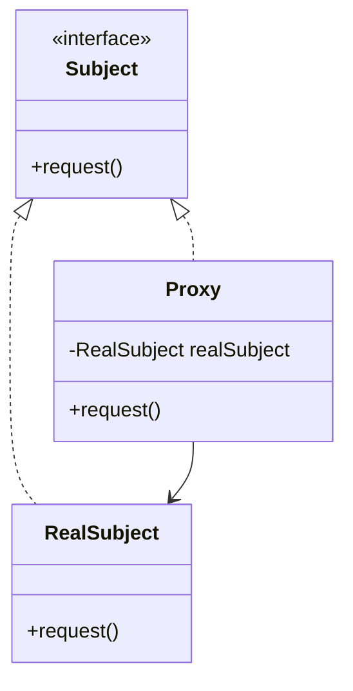

# Proxy Pattern

## Intent
Provide a surrogate or placeholder for another object to control access to it.

## Mermaid Diagram


## Interview Note
Useful for lazy initialization (Virtual Proxy), access control (Protection Proxy), or logging/caching.

## Easy to Remember Example (Java)
```java
interface Image { void display(); }

class RealImage implements Image {
    public RealImage(String filename) { loadFromDisk(filename); }
    private void loadFromDisk(String filename) { /* Heavy operation */ }
    public void display() { System.out.println("Displaying image"); }
}

class ProxyImage implements Image {
    private RealImage realImage;
    private String filename;

    public ProxyImage(String filename) { this.filename = filename; }

    public void display() {
        if (realImage == null) { realImage = new RealImage(filename); }
        realImage.display();
    }
}
```
