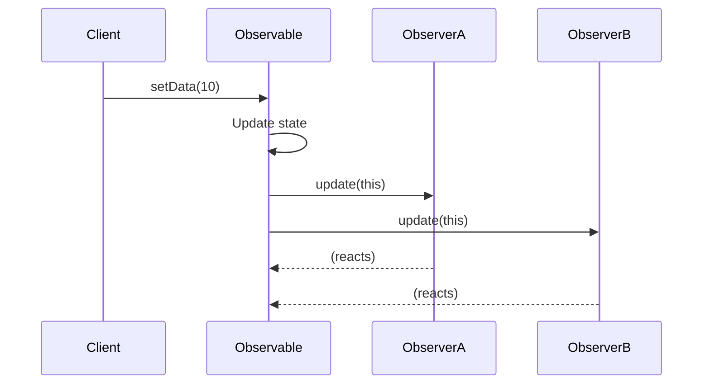

# Observer Design Pattern

## Observer Pattern

The Observer pattern is a behavioral design pattern that allows an object (the subject or observable) to notify a list of dependents (observers) automatically when its state changes. This pattern is commonly used to implement distributed event handling systems.

---

## Theory
Observer pattern is basically a subscribe-subscriber design pattern. In this we have an Observable interface and an Observer interface.
- **Observable** interface has: `add()`, `remove()`, `setData()`, `notifyAll()`
- **Observer** interface has: `update()` whose input type is the Observable object. This allows sharing the updated state of the Observable to the Observer, without constructor injection.
- When the state of Observable changes, it notifies all its subscribers.

---

## Participants Summary
| Participant                | Responsibility                            |
|----------------------------|-------------------------------------------|
| Observable (Subject)       | Maintains observers, notifies on changes  |
| Observer                   | Receives updates from Observable          |
| ConcreteObservable         | Implements Observable, manages state      |
| ConcreteObserver           | Implements Observer, reacts to updates    |

---

## Java Example

### Observable Interface
```java
package CommonlyUsedDesignPatterns.BehaviouralDesignPatterns.ObserverDesignPattern;

public interface Observable {
    public void add(Observer o);
    public void remove(Observer o);
    public void notifySubscribers();
    public void setData(int x);
    public int getData();
}
```

### Observer Interface
```java
package CommonlyUsedDesignPatterns.BehaviouralDesignPatterns.ObserverDesignPattern;

public interface Observer {
    public void update(Observable o);
}
```

### Concrete Observable Implementation
```java
package CommonlyUsedDesignPatterns.BehaviouralDesignPatterns.ObserverDesignPattern;

import java.util.ArrayList;
import java.util.List;

public class IphoneObservableImpl implements Observable {
    private List<Observer> iphoneStockObservers = new ArrayList<>();
    private int stock = 0;
    @Override
    public void add(Observer o) {
        iphoneStockObservers.add(o);
    }
    @Override
    public void remove(Observer o) {
        iphoneStockObservers.remove(o);
    }
    @Override
    public void notifySubscribers() {
        for (Observer o : iphoneStockObservers) {
            o.update(this);
        }
    }
    @Override
    public void setData(int x) {
        if (stock == 0) {
            stock += x;
            notifySubscribers();
        } else stock += x;
    }
    public int getData() {
        return stock;
    }
}
```

### Concrete Observer Implementations
```java
package CommonlyUsedDesignPatterns.BehaviouralDesignPatterns.ObserverDesignPattern;

public class EmailAlertObserver implements Observer {
    private String userName;
    public EmailAlertObserver(String userName) {
        this.userName = userName;
    }
    @Override
    public void update(Observable o) {
        System.out.println("new Email sent to " + userName + "\n" + "Email Content: Iphone stock has been restocked to : " + o.getData());
    }
}

public class MessageAlertObserver implements Observer {
    private String userName;
    public MessageAlertObserver(String userName) {
        this.userName = userName;
    }
    @Override
    public void update(Observable o) {
        System.out.println("new Message sent to " + userName + "\n" + "Message Content: Iphone stock has been restocked to : " + o.getData());
    }
}
```

### Demo
```java
package CommonlyUsedDesignPatterns.BehaviouralDesignPatterns.ObserverDesignPattern;

public class Demo {
    public static void main(String[] args) {
        Observer ishan = new EmailAlertObserver("Ishan");
        Observer gargi = new EmailAlertObserver("Gargi");
        Observer ishu = new MessageAlertObserver("Ishu");

        Observable iphonestocks = new IphoneObservableImpl();
        iphonestocks.add(ishan);
        iphonestocks.add(gargi);
        iphonestocks.add(ishu);

        iphonestocks.setData(10);
    }
}
```

---

## Sequence Diagram (Markdown)


---

## When to Use
- When a change to one object requires changing others.
- When you want to avoid tight coupling between subject and observers.

---

## Key Points
- Promotes loose coupling between subject and observer.
- Useful for implementing distributed event handling systems (e.g., GUI listeners, event buses).
- **Observable**: Interface with methods to add/remove observers, update state, and notify all observers.
- **Observer**: Interface with the update() method.
- **Concrete Observable**: Implements Observable, manages state, and notifies observers.
- **Concrete Observer**: Implements Observer, receives updates.

## Example: iPhone Stock Alert System

### Interfaces
```java
// Observable.java
package CommonlyUsedDesignPatterns.BehaviouralDesignPatterns.ObserverDesignPattern;

public interface Observable {
    public void add(Observer o);
    public void remove(Observer o);
    public void notifySubscribers();
    public void setData(int x);
    public int getData();
}
```

```java
// Observer.java
package CommonlyUsedDesignPatterns.BehaviouralDesignPatterns.ObserverDesignPattern;

public interface Observer {
    public void update(Observable o);
}
```

### Concrete Observer Implementations
```java
// EmailAlertObserver.java
package CommonlyUsedDesignPatterns.BehaviouralDesignPatterns.ObserverDesignPattern;

public class EmailAlertObserver implements Observer{
    private String userName;
    public EmailAlertObserver(String userName) {
        this.userName = userName;
    }
    @Override
    public void update(Observable o) {
        System.out.println("new Email sent to "+ userName + "\n" + "Email Content: Iphone stock has been restocked to : "+ o.getData());
    }
}
```

```java
// MessageAlertObserver.java
package CommonlyUsedDesignPatterns.BehaviouralDesignPatterns.ObserverDesignPattern;

public class MessageAlertObserver implements Observer{
    private String userName;
    public MessageAlertObserver(String userName) {
        this.userName = userName;
    }
    @Override
    public void update(Observable o) {
        System.out.println("new Message sent to "+ userName + "\n" + "Message Content: Iphone stock has been restocked to : "+ o.getData());
    }
}
```

### Concrete Observable Implementation
```java
// IphoneObservableImpl.java
package CommonlyUsedDesignPatterns.BehaviouralDesignPatterns.ObserverDesignPattern;

import java.util.ArrayList;
import java.util.List;

public class IphoneObservableImpl implements Observable{
    private List<Observer> iphoneStockObservers = new ArrayList<>();
    private int stock = 0 ;
    @Override
    public void add(Observer o) {
        iphoneStockObservers.add(o);
    }
    @Override
    public void remove(Observer o) {
        iphoneStockObservers.remove(o);
    }
    @Override
    public void notifySubscribers() {
        for(Observer o : iphoneStockObservers){
            o.update(this);
        }
    }
    @Override
    public void setData(int x) {
        if(stock == 0){
            stock+= x;
            notifySubscribers();
        }
        else stock+= x;
    }
    public int getData(){
        return stock;
    }
}
```

### Demo: Running the Observer Pattern
```java
// Demo.java
package CommonlyUsedDesignPatterns.BehaviouralDesignPatterns.ObserverDesignPattern;

public class Demo {
    public static void main(String[] args) {
        Observer ishan = new EmailAlertObserver("Ishan");
        Observer gargi = new EmailAlertObserver("Gargi");
        Observer ishu = new MessageAlertObserver("Ishu");

        Observable iphonestocks = new IphoneObservableImpl();
        iphonestocks.add(ishan);
        iphonestocks.add(gargi);
        iphonestocks.add(ishu);

        iphonestocks.setData(10);
    }
}
```

## Key Points
- Observer pattern decouples the subject and observers, allowing dynamic subscription and notification.
- Used in event-driven systems, GUIs, and any scenario where changes in one object should be reflected in others.

## References
- [Theory.txt]: Observer pattern is basically subscribe-subscriber design pattern. Observable interface has add(), remove(), setData(), NotifyAll(). Observer has update() whose input type is observable object. This is done to prevent constructor injection of observable in the observer and in simple terms sharing the updated state of observable to the observer. When the state of observable changes it notifies all its subscribers.
