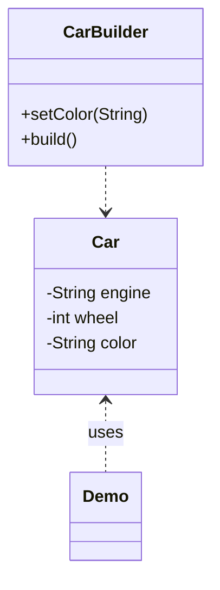

# Builder Design Pattern

**Definition:**
Separates the construction of a complex object from its representation, allowing the same construction process to create different representations.

**Concept:**
The Builder pattern constructs complex objects step by step. It enables the creation of different representations of an object using the same construction process, isolating the construction logic from the object itself. This is useful when an object requires numerous configuration options or assembly steps.

**Analogy:**
Think of building a meal at a restaurant. You (the Director) instruct the chef (the Builder) step by step—choose a drink, main course, dessert, etc. The chef follows your instructions to assemble the meal, but you can ask for different combinations each time.

**Participants Table**
| Participant      | Example Class     | Role                                      |
|------------------|------------------|-------------------------------------------|
| Builder          | CarBuilder        | Specifies steps to build parts of Product  |
| ConcreteBuilder  | CarBuilder        | Implements steps to assemble the product   |
| Director         | Demo (main)       | Constructs the object using the Builder    |
| Product          | Car               | The complex object being built             |

**Mermaid Class Diagram**


**Java Example**

### Product & Builder
```java
public class Car {
    private final String engine;
    private final int wheel;
    private String color;

    private Car(CarBuilder builder) {
        engine = builder.engine;
        wheel = builder.wheel;
        color = builder.color;
    }
    public String getEngine() { return engine; }
    public int getWheel() { return wheel; }
    public String getColor() { return color; }
    @Override
    public String toString() {
        return "Car{" + "engine='" + engine + '\'' + ", wheel=" + wheel + ", color='" + color + '\'' + '}';
    }
    static class CarBuilder {
        private final String engine;
        private final int wheel;
        private String color = "Black";
        public CarBuilder(String engine, int wheel) {
            this.engine = engine;
            this.wheel = wheel;
        }
        public CarBuilder setColor(String color) {
            this.color = color;
            return this;
        }
        public Car build() {
            return new Car(this);
        }
    }
}
```

### Director & Demo
```java
public class Demo {
    public static void main(String[] args) {
        Car.CarBuilder builder = new Car.CarBuilder("V8 Engine", 4);
        Car car = builder.setColor("Blue").build();
        System.out.println(car);
        // builder creates a new object every time.
        car = builder.setColor("Black").build();
        System.out.println(car);
    }
}
```

**Benefits:**
- Step-by-step construction
- Different representations with the same process
- Isolates complex construction logic

**When to Use:**
- Object creation is complex or involves many optional parts
- You want to separate construction code from the product

**Real World Examples:**
- Building a house: Foundation, walls, roof, etc., constructed step by step.
- Assembling a computer: Adding CPU, RAM, storage, etc.
- Creating a meal: Appetizer, main course, dessert, etc.

**Key Points:**
- Promotes code reuse and consistency.
- Allows customization of construction steps.

**Structure:**
| Participant        | Role                                                        |
|--------------------|-------------------------------------------------------------|
| Builder (Interface)| Specifies steps to build parts of the Product               |
| ConcreteBuilder    | Implements steps to assemble the product                    |
| Director           | Constructs the object using the Builder interface           |
| Product            | The complex object being built                              |

```
+-----------+        +-------------------+        +-------------------+
|  Director | -----> |     Builder       | <----- | ConcreteBuilder   |
+-----------+        +-------------------+        +-------------------+
                                         |
                                         v
                                   +-----------+
                                   |  Product  |
                                   +-----------+
```

**Benefits:**
- Step-by-step construction
- Different representations with the same process
- Isolates complex construction logic

**When to Use:**
- Object creation is complex or involves many optional parts
- You want to separate construction code from the product
